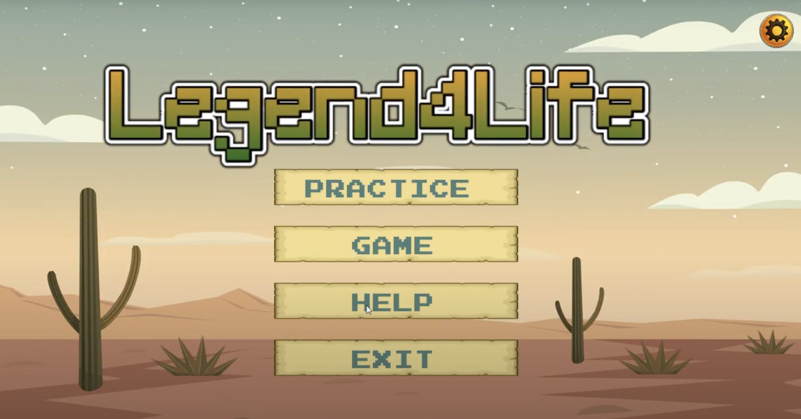
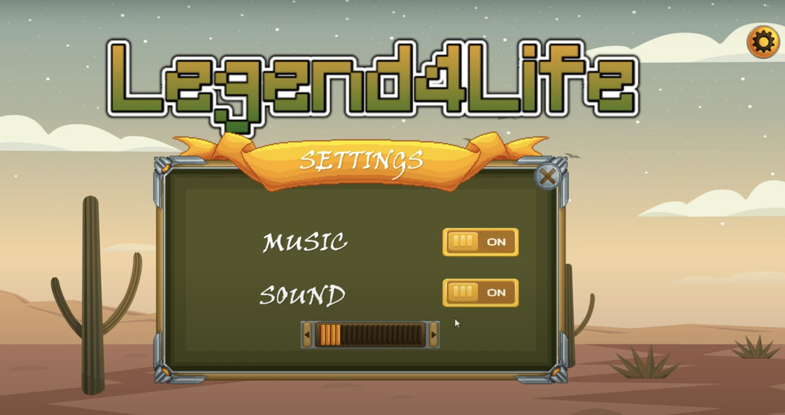
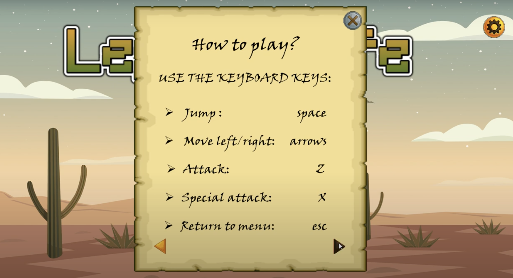
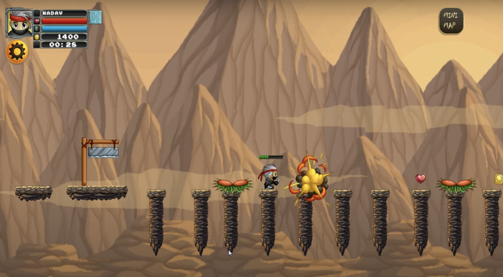
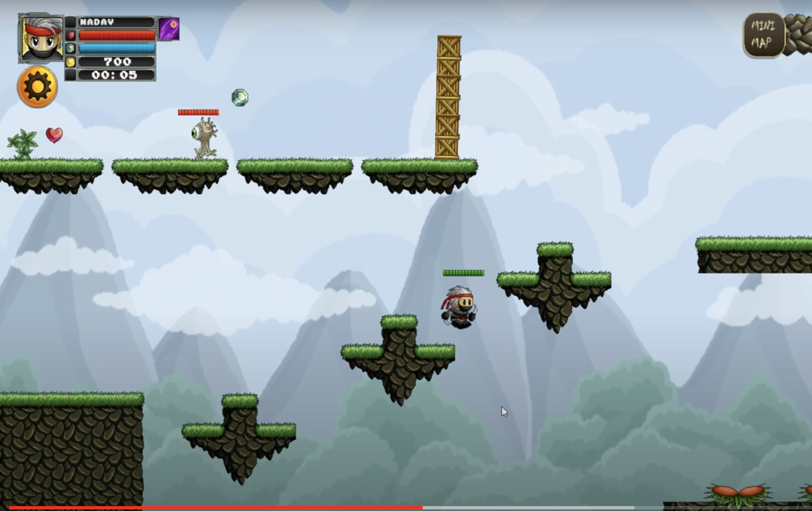
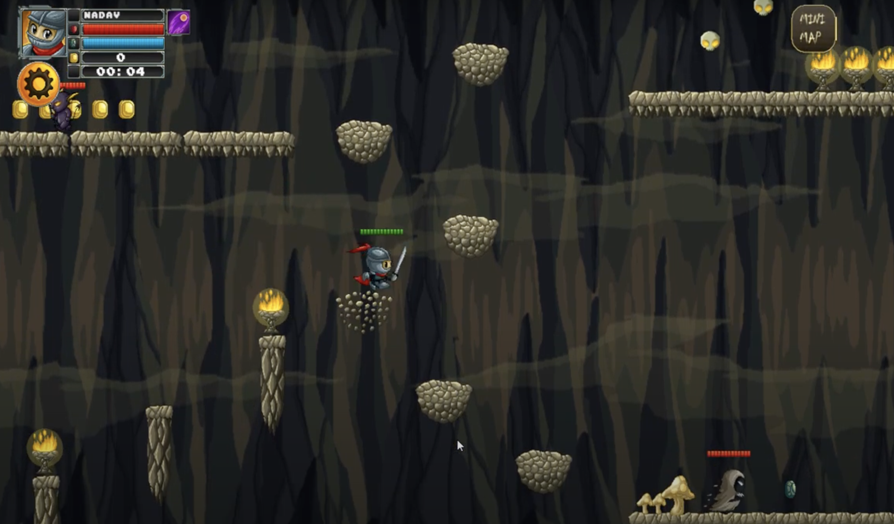

# LEGEND4LIFE
## [Game Demonstration](https://www.youtube.com/watch?v=9Hs-fVTtyII): Experience our game in action on YouTube.

### Main Menu:

    

### Instructions and Settings:

    
    

### Character, Username, and Level Selection:

    
    

### Game Levels:

    
    
    

## Game Overview:
#### Title: Adventure Game

#### Description:
LEGEND4LIFE is an action-adventure game that challenges players to collect as many coins as possible while swiftly completing each level and defeating enemies. Each level presents a variety of challenges, including falling rocks, bombs, mouse traps, flower traps, hostile enemies, lava, water, heavy boxes that act as walls, and distance and height obstacles. Players can utilize a range of abilities to overcome enemies or navigate through challenges and can modify their special attack using collected crystals.

#### Key Features:

- **Tutorial**: Accessible via the 'help' button in the game menu.
- **Settings**: Players can mute the music or adjust sound effects.
- **Map Overview**: By pressing the 'miniMap' button, players can view the entire map.
- **Character Selection**: Before gameplay starts, players select their world (Earth, Darkness, or Fantasy) and then choose one of four characters.
- **Player Abilities**: Characters can run, jump, attack, and use a special ranged attack.
- **Lives System**: Players have a dynamic life bar; collecting hearts can prolong their life in the game. Enemies also have life bars to indicate their remaining health.
- **Collectibles**: Players can gather coins, hearts, arrows for speed boosts, and crystals to change their special attack.
- **Game Progression**: After completing a level, players can either return to the main menu or proceed to the next level. Upon victory, the game displays the number of coins collected and the time taken.

#### Technical Highlights:
- **Factory Design Pattern**: Utilized for the creation of game objects.
- **Command Pattern**: Manages in-game menus.
- **State Design Pattern**: Manages the various game screens.
- **Physics**: The game employs Box2d for physical world simulation.
- **MultiMethod Design Pattern**: Implemented for efficient collision handling using Box2d's `collisionListener`, with look-ups streamlined through an unordered map and a custom hashing function in the `HashHandler` class.